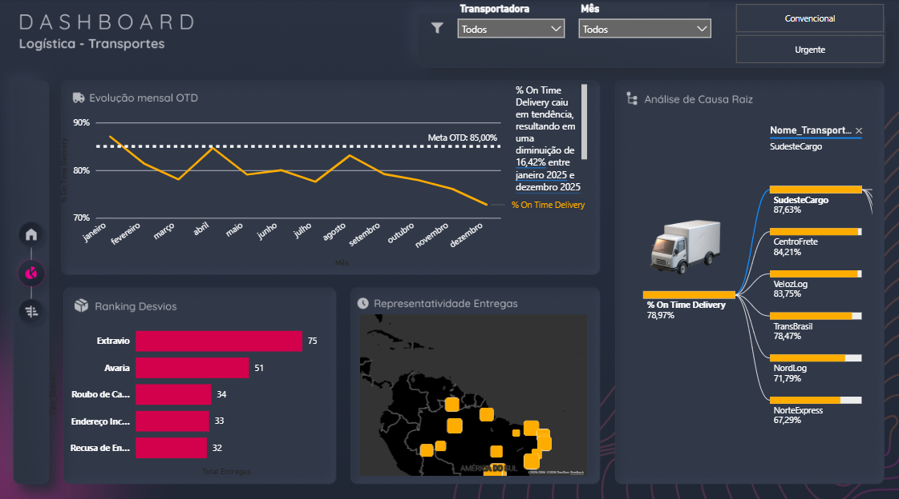

# Análise de Desempenho de Transportadoras | Power BI



Dashboard desenvolvido para análise do histórico de entregas e desempenho de transportadoras ao longo de 2025, com foco em KPIs operacionais de logística, identificação de desvios e custos de frete.

---

## 📌 Objetivo

Transformar dados brutos de transporte em insights acionáveis para apoiar a **tomada de decisão logística**, respondendo perguntas como:

- Qual transportadora apresenta maior taxa de desvios?
- Fretes urgentes compensam financeiramente?
- Em quais rotas e regiões as entregas atrasam mais?
- Como está distribuído o custo de frete por kg entre as transportadoras?

---

## 📊 Visão Geral dos Dados

| Item | Detalhe |
|---|---|
| Período analisado | Janeiro a Dezembro de 2025 |
| Total de entregas | ~1.800 registros |
| Transportadoras | 6 (5 regionais + 1 nacional) |
| Tipos de frete | Convencional e Urgente |
| Cobertura geográfica | Todo o Brasil |

### Transportadoras analisadas

| ID | Nome | Região | Estados Atendidos |
|---|---|---|---|
| TRP001 | VelozLog | Sul | RS, SC, PR |
| TRP002 | NorteExpress | Norte | AM, PA, RO, AC, AP, RR, TO |
| TRP003 | CentroFrete | Centro-Oeste | GO, MT, MS, DF |
| TRP004 | SudesteCargo | Sudeste | SP, RJ, MG, ES |
| TRP005 | NordLog | Nordeste | BA, PE, CE, MA, PI, RN, PB, AL, SE |
| TRP006 | TransBrasil | Nacional | Todos os estados |

### Tipos de desvio registrados

- Avaria
- Extravio
- Roubo de Carga
- Endereço Incorreto
- Recusa de Entrega

---

## 📁 Estrutura do Repositório

```
analise-transporte-powerbi/
│
├── data/
│   ├── Historico_Transporte.xlsx   # Base de dados com histórico de entregas
│   └── Transportadoras.txt         # Cadastro das transportadoras
│
├── dashboard/
│   └── Analise_e_relatorio_BI.pbix # Dashboard Power BI
│
├── images/
│   └── dashboard_preview.png       # Preview do dashboard
│
└── README.md
```

---

## 🛠️ Ferramentas Utilizadas

- **Power BI Desktop** — modelagem de dados, DAX e visualizações
- **Microsoft Excel** — fonte de dados principal
- **Power Query** — tratamento e transformação dos dados

---

## 🔑 Principais KPIs do Dashboard

- **Taxa de Pontualidade** — % de entregas realizadas dentro do prazo
- **Taxa de Desvio** — % de entregas com ocorrência de avaria, extravio, roubo, etc.
- **Custo Médio de Frete (R$/kg)** — por transportadora e tipo de frete
- **Ticket Médio de NF** — valor médio das notas fiscais transportadas
- **Prazo Médio de Entrega** — dias médios por transportadora e região
- **Volume de Entregas** — distribuição mensal e por transportadora

---

## 🚀 Como Abrir o Dashboard

1. Baixe e instale o [Power BI Desktop](https://powerbi.microsoft.com/pt-br/desktop/) (gratuito)
2. Clone ou baixe este repositório
3. Abra o arquivo `dashboard/Analise_e_relatorio_BI.pbix`
4. O dashboard carregará com todos os dados e visualizações

---

## 📚 Contexto

Projeto desenvolvido durante um **intensivo de análise de dados**, com o objetivo de praticar:

- Modelagem de dados relacionais no Power BI
- Criação de medidas DAX para KPIs logísticos
- Construção de dashboards interativos com filtros e drill-down
- Análise de dados reais do setor de logística e supply chain

---

## 👤 Autor

**Anna Kelly Sousa**
[LinkedIn](https://linkedin.com/in/anna-kelly-sousa-084a152b5) • [GitHub](https://github.com/anna-kelly)

---

> 📝 *Os dados utilizados neste projeto são fictícios, criados para fins educacionais.*
